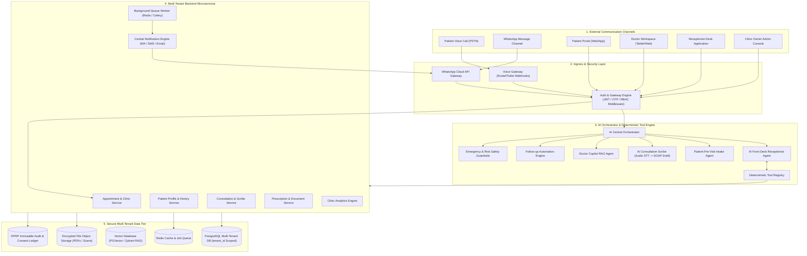

<div align="center">

# 🩺 AI Hospital OS (DoctorOS)
### Next-Generation AI-Powered Clinic Operating System

[](https://github.com/faisalhasan00/AI-Hospital-OS)
[](https://github.com/faisalhasan00/AI-Hospital-OS)
[](https://github.com/faisalhasan00/AI-Hospital-OS)
[](https://github.com/faisalhasan00/AI-Hospital-OS)
[](https://github.com/faisalhasan00/AI-Hospital-OS)
[](https://github.com/faisalhasan00/AI-Hospital-OS)

<p align="center">
  <b>Automating repetitive clinic front-desk administrative tasks while providing doctors with an intelligent pre-consultation workspace, real-time SOAP scribe, and automated patient follow-ups.</b>
</p>

---

</div>

## 📌 Executive Summary

Small and medium-sized outpatient clinics struggle with receptionist phone overload, fragmented patient communications, manual follow-ups, and a lack of pre-consultation patient context for doctors. 

**AI Hospital OS (DoctorOS)** is an enterprise multi-tenant platform that seamlessly connects:

$$\text{Patient} \longrightarrow \text{AI Front Desk} \longrightarrow \text{Intake} \longrightarrow \text{Doctor Workspace} \longrightarrow \text{AI Scribe} \longrightarrow \text{Prescription} \longrightarrow \text{Follow-up}$$

### Core Design Philosophy: *AI Assists, Doctor Decides*
- **No Autonomous Diagnosis**: The AI never independently diagnoses or prescribes medication.
- **Deterministic Tool Calling**: All actions (booking, rescheduling, check-ins) execute through validated backend tool contracts—preventing LLM hallucinations.
- **Human-in-the-Loop Validation**: Consultation notes and prescriptions require explicit doctor review, edit, and approval before locking records or delivering PDFs.

---

## 🏛️ System Architecture Topology



---

## 🔥 Key Operational Modules

### 🤖 1. AI Front Desk & Voice Receptionist
- **Multilingual Telephony & Chat**: Supports **English, Hindi, and Telugu** PSTN calls and WhatsApp messages.
- **Intent Recognition & Slot Checking**: Recognizes intents (`BOOK_APPOINTMENT`, `RESCHEDULE`, `CANCEL`, `CHECK_SCHEDULE`, `CLINIC_HOURS`, `EMERGENCY`).
- **Safety Escalation Protocol**: Instantly flags chest pain, stroke, or severe bleeding, halts diagnosis, issues ambulance instructions, and alerts on-call emergency staff.

### ⚡ 2. Patient Intelligence & Pre-Consultation Summary
- **Data Provenance Segregation**: Explicitly separates **Patient-Reported Information** (unverified intake/chat inputs) from **Doctor-Confirmed Clinical Information** (verified medical records).
- **Pre-Consult Brief**: Summarizes chief complaints, previous visits, recent lab reports, and allergy flags for the doctor in seconds.

### 🎙️ 3. AI Consultation Scribe & Doctor Workspace
- **Real-Time Speech-to-Text**: Converts doctor-patient conversation audio into structured SOAP draft notes:
  - **Subjective**: Chief Complaint & History of Present Illness.
  - **Objective**: Physical Examination Findings observed by the doctor.
  - **Assessment**: Clinical Impression / Draft Diagnosis.
  - **Plan**: Prescriptions, Advice, and Follow-up timeframe.
- **Doctor Approval**: Doctors review, edit, and approve notes before generating encrypted PDF prescriptions for automated WhatsApp delivery.

### 📱 4. Follow-up Automation Engine
- Schedules background check-in jobs based on doctor instructions (e.g., *3 days post-visit*).
- Evaluates patient WhatsApp replies and triages recovery status:
  - `IMPROVING`: Patient recovering well (Logged automatically).
  - `NEEDS_REVIEW`: Persistent symptoms (Creates urgent task in Doctor/Receptionist queue).
  - `EMERGENCY`: High-risk symptoms reported (Triggers immediate SMS alerts to doctor).

### 📊 5. Clinic Analytics & Reception Queue
- Live dashboard tracking patient volume, queue wait times, no-show rates, revenue metrics, and AI call handle rates.

---

## 🛠️ Project Repository Structure

```
AI-Hospital-OS/
├── backend/
│   ├── src/
│   │   ├── db/
│   │   │   ├── doctoros_schema.sql       # PostgreSQL multi-tenant SQL schema
│   │   │   └── supabaseClient.js         # Supabase DB connection client
│   │   ├── domain/                       # Specialized AI agent domain logic
│   │   ├── services/
│   │   │   ├── toolRegistry.js            # Deterministic AI Tool Calling schemas & handlers
│   │   │   ├── orchestratorService.js     # AI Front Desk Voice & WhatsApp Orchestrator
│   │   │   ├── scribeService.js           # AI Consultation Scribe & SOAP Generator
│   │   │   ├── followupEngine.js          # Follow-up job processor & risk triage
│   │   │   └── llmService.js              # Gemini API client with exponential retries
│   │   └── server.js                      # Express API Server & DoctorOS routes
│   ├── package.json
│   └── .env
│
├── frontend/
│   ├── src/
│   │   ├── features/
│   │   │   └── doctoros/
│   │   │       ├── DoctorOSWorkspace.jsx  # Main DoctorOS React UI Component
│   │   │       └── DoctorOSWorkspace.css  # Modern dark-mode styling system
│   │   ├── App.jsx                        # Application root layout & navigation
│   │   └── main.jsx
│   ├── package.json
│   └── vite.config.js
│
└── README.md
```

---

## 🗄️ Multi-Tenant Relational Data Schema

The database model is built on **PostgreSQL**, with strict `tenant_id` (`clinic_id`) isolation across all entities:

```sql
-- Clinics / Tenants Master
CREATE TABLE clinics (
    id UUID PRIMARY KEY DEFAULT gen_random_uuid(),
    name VARCHAR(255) NOT NULL,
    code VARCHAR(50) UNIQUE NOT NULL,
    phone VARCHAR(20) NOT NULL,
    ai_config JSONB,
    created_at TIMESTAMP WITH TIME ZONE DEFAULT NOW()
);

-- Doctor Profiles
CREATE TABLE doctors (
    id UUID PRIMARY KEY DEFAULT gen_random_uuid(),
    tenant_id UUID NOT NULL REFERENCES clinics(id) ON DELETE CASCADE,
    user_id UUID NOT NULL REFERENCES users(id),
    specialization VARCHAR(100) NOT NULL,
    consultation_fee NUMERIC(10, 2) DEFAULT 500.00,
    created_at TIMESTAMP WITH TIME ZONE DEFAULT NOW()
);

-- Patients Master
CREATE TABLE patients (
    id UUID PRIMARY KEY DEFAULT gen_random_uuid(),
    tenant_id UUID NOT NULL REFERENCES clinics(id) ON DELETE CASCADE,
    uhid VARCHAR(50) NOT NULL,
    full_name VARCHAR(255) NOT NULL,
    phone VARCHAR(20) NOT NULL,
    allergies JSONB DEFAULT '[]'::jsonb,
    preferred_language VARCHAR(20) DEFAULT 'en',
    created_at TIMESTAMP WITH TIME ZONE DEFAULT NOW()
);

-- Appointments
CREATE TABLE appointments (
    id UUID PRIMARY KEY DEFAULT gen_random_uuid(),
    tenant_id UUID NOT NULL REFERENCES clinics(id) ON DELETE CASCADE,
    patient_id UUID NOT NULL REFERENCES patients(id),
    doctor_id UUID NOT NULL REFERENCES doctors(id),
    appointment_date DATE NOT NULL,
    start_time TIME NOT NULL,
    status VARCHAR(50) DEFAULT 'SCHEDULED', -- 'SCHEDULED', 'WAITING', 'COMPLETED', 'CANCELLED'
    booking_channel VARCHAR(50) DEFAULT 'AI_VOICE'
);
```

---

## ⚙️ Deterministic Tool Calling Registry

To eliminate hallucinations, the AI agent invokes backend logic using strict JSON specs:

```json
{
  "name": "book_appointment",
  "description": "Book a confirmed appointment for a patient",
  "parameters": {
    "type": "object",
    "properties": {
      "doctor_name": { "type": "string" },
      "patient_phone": { "type": "string" },
      "patient_name": { "type": "string" },
      "appointment_date": { "type": "string", "format": "date" },
      "start_time": { "type": "string", "format": "time" },
      "reason_for_visit": { "type": "string" }
    },
    "required": ["patient_phone", "patient_name", "appointment_date", "start_time"]
  }
}
```

---

## 🌐 API Endpoint Reference

| Method | Endpoint | Description |
| :--- | :--- | :--- |
| `POST` | `/api/doctoros/front-desk` | Process Voice/WhatsApp message intent & trigger tools |
| `POST` | `/api/doctoros/scribe/draft` | Convert consultation transcript into SOAP draft note |
| `POST` | `/api/doctoros/consultation/approve` | Doctor approval of SOAP note, prescription PDF & follow-up |
| `POST` | `/api/doctoros/followup/response` | Triage patient follow-up reply (`IMPROVING`, `NEEDS_REVIEW`, `EMERGENCY`) |
| `GET` | `/api/doctoros/clinic-dashboard` | Retrieve live clinic analytics, metrics & upcoming queue |

---

## 💻 Local Setup & Development Guide

### Prerequisites
- **Node.js**: v18.0 or higher
- **npm**: v9.0 or higher
- **PostgreSQL / Supabase Account** (Optional for cloud DB)

### 1. Environment Variables Configuration
Create a `.env` file in the `/backend` directory:
```env
PORT=5000
GEMINI_API_KEY=your_gemini_api_key_here
SUPABASE_URL=your_supabase_url
SUPABASE_ANON_KEY=your_supabase_anon_key
```

### 2. Backend Server Setup
```bash
cd backend
npm install
npm run dev
```
The Express backend server will run on `http://localhost:5000`.

### 3. Frontend Web Client Setup
```bash
cd frontend
npm install
npm run dev
```
The React + Vite application will run on `http://localhost:5173`.

---

## 🔒 Privacy, Security & India DPDP Compliance

- **Data Minimization & Consent Ledger**: Captures explicit patient consent (`patient_consents`) before voice or message processing.
- **Immutable Audit Trail**: All access to patient health records produces an entry in `audit_logs`.
- **Field-Level Encryption**: Sensitive identifiers (PHI) are encrypted at rest using AES-256-GCM.
- **ABDM Readiness**: Architecture designed for Ayushman Bharat Digital Mission (ABHA / HIP / HIU) interoperability.

---

<div align="center">

**Developed with ❤️ for Modern Digital Healthcare Clinics**

</div>
